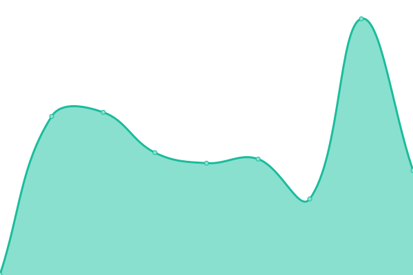

# [📈 Live Status](https://status.ummit.dev): <!--live status--> **🟩 All systems operational**

This repository contains the open-source uptime monitor and status page for [UmmIt](https://ummit.dev), powered by [Upptime](https://github.com/upptime/upptime).

With [Upptime](https://upptime.js.org), you can get your own unlimited and free uptime monitor and status page, powered entirely by a GitHub repository. We use [Issues](https://github.com/UmmItC/upptime/issues) as incident reports, [Actions](https://github.com/UmmItC/upptime/actions) as uptime monitors, and [Pages](https://status.ummit.dev) for the status page.

<!--start: status pages-->
<!-- This summary is generated by Upptime (https://github.com/upptime/upptime) -->
<!-- Do not edit this manually, your changes will be overwritten -->
<!-- prettier-ignore -->
| URL | Status | History | Response Time | Uptime |
| --- | ------ | ------- | ------------- | ------ |
|  [Links](https://links.ummit.dev) | 🟩 Up | [links.yml](https://github.com/UmmItKin/Upptime/commits/HEAD/history/links.yml) | 

 334ms
     
 | 

<a href="https://status.ummit.dev/history/links">100.00%</a>
    

|  [Blog (Old with Hugo)](https://blog.ummit.dev) | 🟩 Up | [blog-old-with-hugo.yml](https://github.com/UmmItKin/Upptime/commits/HEAD/history/blog-old-with-hugo.yml) | 

 269ms
     
 | 

<a href="https://status.ummit.dev/history/blog-old-with-hugo">98.63%</a>
    

|  [Blog (New with Astro)](https://blog.withkin.me) | 🟩 Up | [blog-new-with-astro.yml](https://github.com/UmmItKin/Upptime/commits/HEAD/history/blog-new-with-astro.yml) | 

 225ms
     
 | 

<a href="https://status.ummit.dev/history/blog-new-with-astro">100.00%</a>
    

<!--end: status pages-->

[**Visit our status website →**](https://status.ummit.dev)

## 📄 License

- Powered by: [Upptime](https://github.com/upptime/upptime)
- Code: [MIT](./LICENSE) © [Anand Chowdhary](https://anandchowdhary.com), supported by [Pabio](https://pabio.com)
- Data in the `./history` directory: [Open Database License](https://opendatacommons.org/licenses/odbl/1-0/)
